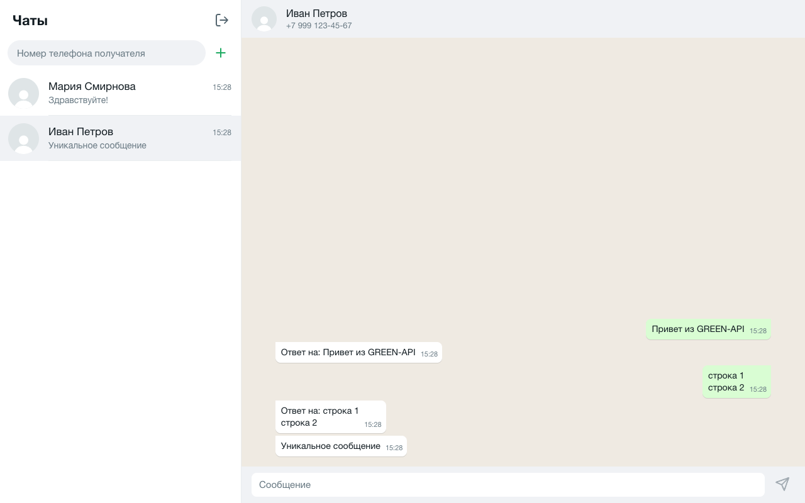
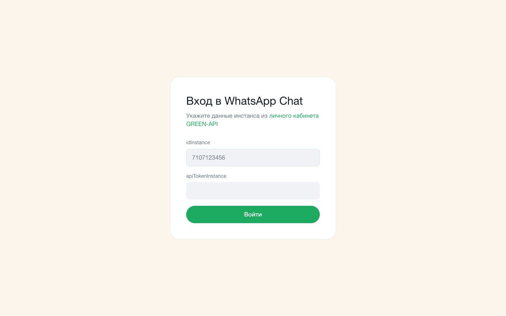
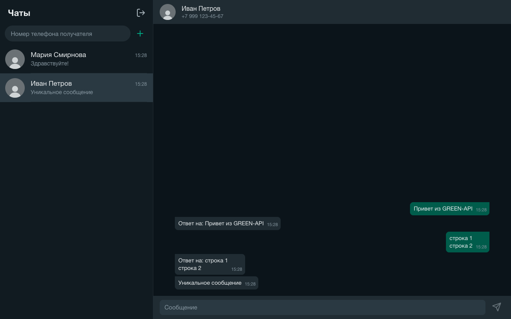
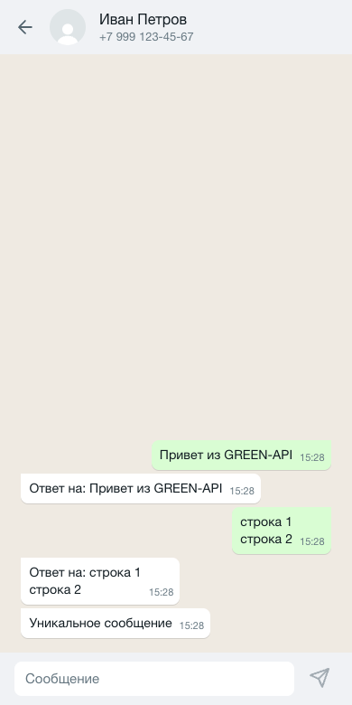

# WhatsApp Chat · GREEN-API

Отправка и получение текстовых сообщений WhatsApp через [GREEN-API](https://green-api.com/). Интерфейс повторяет web.whatsapp.com.



<details>
<summary>Вход, тёмная тема, мобильная версия</summary>





</details>

## Запуск

Node.js 20.19+.

```bash
npm ci
npm run dev
```

Приложение: http://localhost:5173.

## Настройка инстанса

В [личном кабинете GREEN-API](https://console.green-api.com):

1. Авторизуйте инстанс WhatsApp по QR-коду.
2. В настройках инстанса: `webhookUrl` пустой, `incomingWebhook: yes`, `EnableLidMode: no`.

## Использование

1. Войдите с `idInstance` и `apiTokenInstance`.
2. Введите номер получателя (`79991234567`, `+7 999 123-45-67` или `8 999 123-45-67`) и нажмите «+».
3. Enter отправляет сообщение, Shift+Enter переносит строку.
4. Ответы появляются в чате автоматически.

## Скрипты

| Команда           | Что делает                             |
| ----------------- | -------------------------------------- |
| `npm run dev`     | dev-сервер                             |
| `npm run build`   | проверка типов и сборка в `dist`       |
| `npm run preview` | просмотр сборки                        |
| `npm run lint`    | ESLint и Steiger (проверка правил FSD) |
| `npm test`        | unit-тесты                             |
| `npm run format`  | Prettier                               |

## Стек

React 19, TypeScript, Vite, Zustand, TanStack Query, CSS Modules, Vitest.

## Архитектура

[Feature-Sliced Design](https://feature-sliced.design/): слой импортирует только нижележащие слои, слайс доступен через `index.ts`.

```
src/
├── app/        точка входа, провайдеры, стили и дизайн-токены
├── pages/      login, messenger
├── widgets/    chat-sidebar (список чатов), chat-window (шапка, лента, поле ввода)
├── features/   auth, create-chat, send-message, receive-messages
├── entities/   session, chat, message
└── shared/     api (клиент GREEN-API), config, lib, ui
```

Типы и интерфейсы лежат в `types.ts` (`model/types.ts`, `ui/types.ts`), константы — в `config`.

## Работа с API

| Действие  | Метод                                                                         |
| --------- | ----------------------------------------------------------------------------- |
| Вход      | `GetStateInstance`: пускает только инстанс со статусом `authorized`           |
| Новый чат | `CheckWhatsapp`; чат адресуется как `79991234567@c.us`                        |
| Отправка  | `SendMessage`                                                                 |
| Получение | `ReceiveNotification` (long polling, 20 с) → обработка → `DeleteNotification` |

- Запросы идут из браузера напрямую на `https://{первые 4 цифры idInstance}.api.green-api.com`.
- Повторная доставка уведомления не создаёт дублей: сообщения дедуплицируются по `idMessage`.
- Уведомление, которое не удалось обработать, всё равно удаляется, чтобы не блокировать очередь.
- При сетевой ошибке опрос повторяется через 5 с.
- Ответ 401 на любой запрос (токен сменили в личном кабинете) завершает сессию, экран входа показывает причину.
- Сессия, чаты и история хранятся в `localStorage` и очищаются при выходе.

## Деплой

`.github/workflows/ci.yml` запускает линтеры, тесты и сборку, а при push в `main` публикует сборку на GitHub Pages (Settings → Pages → Source: GitHub Actions). Сборка использует относительные пути, поэтому `dist` подходит для любого статического хостинга.

## Ограничения

- Бэкенда нет: `apiTokenInstance` хранится в `localStorage`.
- Очередь уведомлений одна на инстанс: открывайте приложение в одной вкладке.
- История начинается с момента входа, прошлая переписка не загружается.
